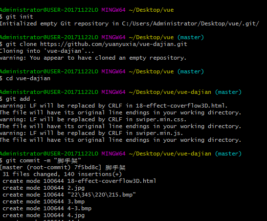
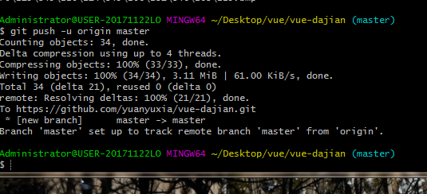

# github
上传步骤
## 1、命令步骤阶段
 * * * 
 
 > 1 git init

  >>> 本地根目录内会多一个 .git 文件夹
  >
 > 2 git clone github上的新建文件路径连接 

  >>>此时 本地根目录文件夹内会多一个与github上新建的文件同名的子文件夹 把要上传的所有文件及文件夹全部复制到 该文件夹内

 > 3 cd 该文件夹名
 	
>4 git add .

>5 git commit -m "提交信息"

>6 git push -u origin master  等待完成
 

